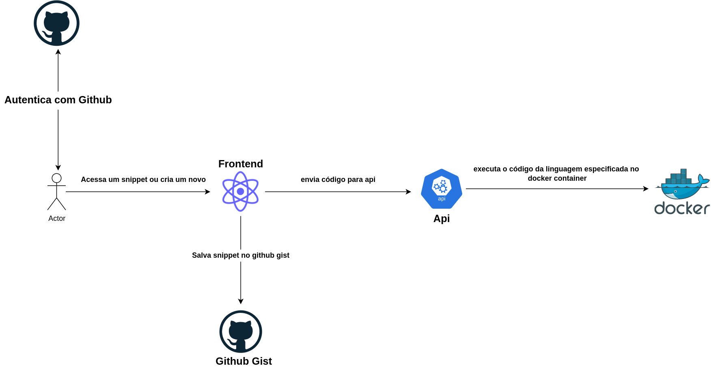

About the project:
====================

The project is focus create simple code editor online. This project have focus challenge me building different things and how to build code editor online not only to javascript but to another languages with php and python.

Another interesting about this project is using login with **Github** using OAuth2 to developers authenticate easily because all dev using Github this way is more interesting and another points is possibility using **Github Gist** to store my snippets.

Technologies:
===============

- Javascript
- Node.js
- React.js
- OAuth2 to login with Github
- Docker
- Docker compose

Architecture:
==============

Instructions to running backend:
==================================

- Clone project
- Access directory **server**
- Execute command: **npm i** install packages
- Create **.env** file based **.env.example**
- Execute command: **docker-compose up -d** to create docker containers to following languages: **javascript**, **php** and **python** to use later to execute code typed editor online.
- Execute command: **npm run start:dev** to start backend application 

Instructions to running frontend:
=================================

- Clone project
- Access directory **client**
- Execute command: **npm i** install packages
- Create **.env** file based **.env.example**
- Execute command: **npm run start** to start frontend application 